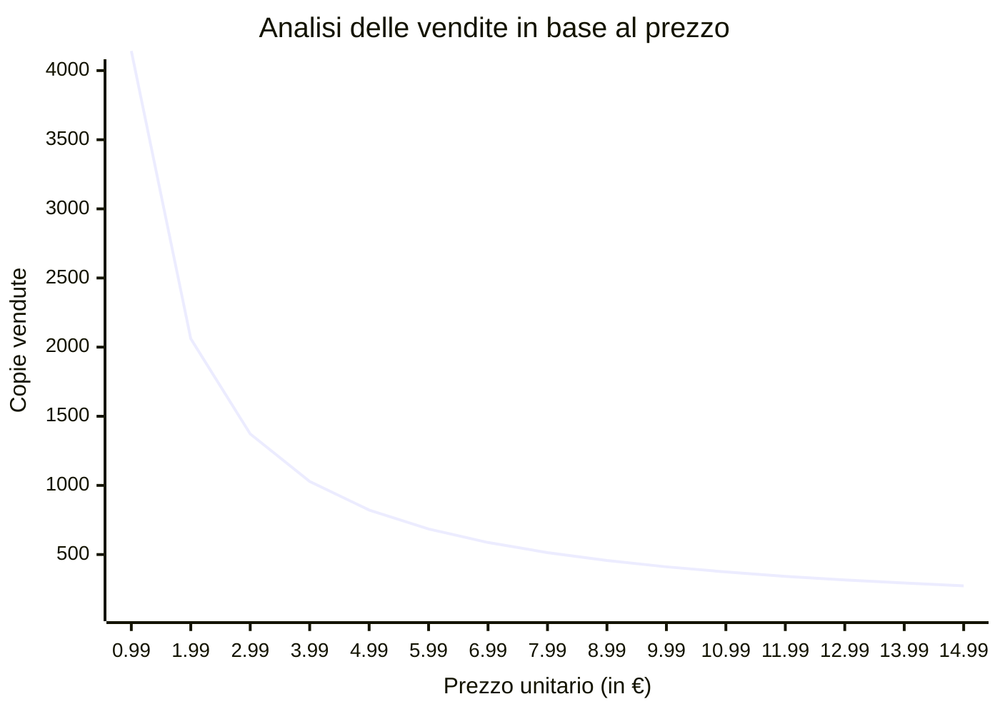

# Analisi finanziaria

## Business Model

Il deliverable sarà pubblicato sulla piattaforma [Steam](https://store.steampowered.com/?l=italian). Questa permette di pubblicizzare e far scaricare il prodotto ai videogiocatori interessati facendogli pagare un prezzo prestabilito. Di questa cifra, Steam trattiene il 30% e il restante viene destinato all'azienda produttrice.

- Prezzo di lancio: 8.99€
- possibilità di sconti periodici tramite le promozioni stagionali

Questa cifra è stata calcolata tramite una pagina di [google sheets](https://docs.google.com/spreadsheets/d/1B05SoctmiqgcXIOkPyeojWCbAbP05F1OtZ33VDwz1cA/edit?usp=sharing) in base all'attesa di copie vendute e al prezzo di lancio.

Il foglio di calcolo evidenzia come la cifra di 8,99€ permetta di coprire i costi di produzione e garantire un margine di 657€ utilizzabili per l'acquisto di software di terze parti. Si notino le seguenti cose:

1. Le stime derivano da un numero di copie vendute conservativo rispetto al mercato di riferimento.
2. Queste stime non prevedono la retribuzione del team in quanto, trattandosi del primo progetto, non si cerca un guadagno quanto piuttosto l'accumulo di esperienza.

Si è creato anche un grafico per visualizzare il rapporto tra le copie vendute e il prezzo di vendita. Il grafico è stato popolato con il numero di copie che permettono di raggiungere la soglia di 4100€ (ovvero 3600€ di costi fissi più 500€ di costi variabili).

## Studio di fattibilità

- I costi fissi monetari derivanti dal progetto sono, fino all'apertura della partita IVA, pari a zero.
- Dei costi possibili possono derivare dall'acquisto di strumenti sviluppati da terzi per velocizzare la produzione software. Questi non dovranno essere superiori a 500 euro.
- Altri costi quali (ad esempio) consumo di elettricità non vengono riportati in questa sezione perchè non rilevanti.

Date quete premesse si ritiene il progetto *fattibile* per quanto riguarda il puro aspetto monetario. Bisogna comunque ricordare che Steam obbliga ad avere una partita IVA al momento della pubblicazione del prodotto, di conseguenza, sarà necessario nel prossimo progetto tenere conto anche dei costi fissi derivanti dall'apertura della p.IVA.