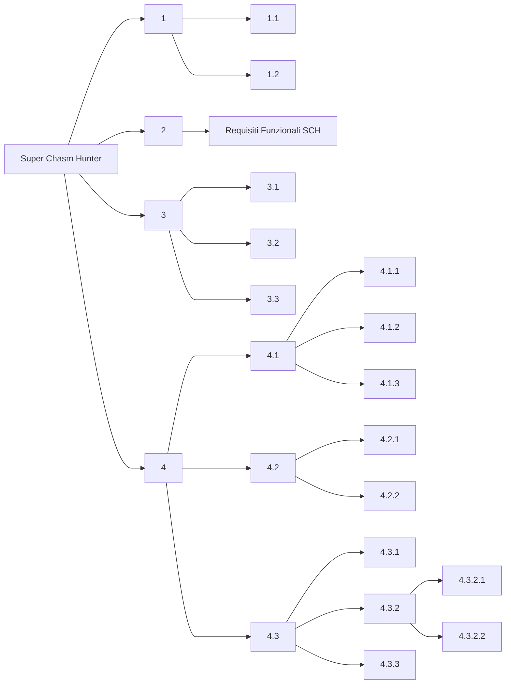

```mermaid
%%{init: { 'flowchart': {"curve": "monotoneX"}} }%%
graph LR
    0[Super Chasm Hunter]
    1
    1.1
    1.2

    2
    2.1[Requisiti Funzionali SCH]
    
    3
    3.1
    3.2
    3.3
    
    4
    4.1
    4.1.1
    4.1.2
    4.1.3
    4.2
    4.2.1
    4.2.2
    4.3
    4.3.1
    4.3.2
    4.3.2.1
    4.3.2.2
    4.3.3

    0 --> 1
    0 --> 2
    0 --> 3
    0 --> 4
    1 --> 1.1
    1 --> 1.2
    2 --> 2.1
    3 --> 3.1
    3 --> 3.2
    3 --> 3.3
    4 --> 4.1
    4 --> 4.2
    4 --> 4.3
    4.1 --> 4.1.1
    4.1 --> 4.1.2
    4.1 --> 4.1.3
    4.2 --> 4.2.1
    4.2 --> 4.2.2
    4.3 --> 4.3.1
    4.3 --> 4.3.2
    4.3.2 --> 4.3.2.1
    4.3.2 --> 4.3.2.2
    4.3 --> 4.3.3

    %% classDef verde fill:#a0f0a0,stroke:#2c2,stroke-width:2px,color:#555;
    %% classDef giallo fill:#fff0a0,stroke:#cc2,stroke-width:2px,color:#555;
    %% classDef rosso fill:#f0a0a0,stroke:#c22,stroke-width:2px,color:#555;
    %% classDef blu fill:#00d5ff,stroke:#0023a3,stroke-width:2px,color:#555;

    %% class 2,3.1,3.2,4.1,4.1.2,4.1.3,4.2,4.2.1,4.2.2 verde;
    %% class 4.3.2,4.3.2.1,4.3.2.2,4.3.3 verde;
    %% class 1,4,1.1,1.2,3.3,4.1.1,4.3,4.3.1, giallo;
    %% class 2.1 blu;
    click 2.1 "./2%20-%20SCH%20Func%20Req.md" "Requisiti funzionali SCH"
    %% class 3 rosso;
```