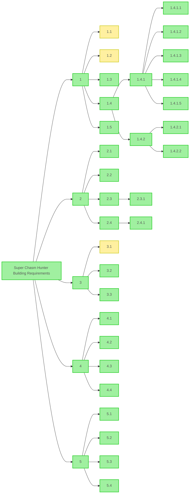

```mermaid
%%{init: { 'flowchart': {"curve": "monotoneX"}} }%%
graph LR
    0[Super Chasm Hunter Building Requirements]
    1
    1.1
    1.2
    1.3
    1.4
    1.4.1
    1.4.1.1
    1.4.1.2
    1.4.1.3
    1.4.1.4
    1.4.1.5
    1.4.2
    1.4.2.1
    1.4.2.2
    1.5
    2
    2.1
    2.2
    2.3
    2.3.1
    2.4
    2.4.1
    3
    3.1
    3.2
    3.3
    4
    4.1
    4.2
    4.3
    4.4
    5
    5.1
    5.2
    5.3
    5.4

    0 --> 1
    1 --> 1.1
    1 --> 1.2
    1 --> 1.3
    1 --> 1.4
    1.4 --> 1.4.1
    1.4.1 --> 1.4.1.1
    1.4.1 --> 1.4.1.2
    1.4.1 --> 1.4.1.3
    1.4.1 --> 1.4.1.4
    1.4.1 --> 1.4.1.5
    1.4 --> 1.4.2
    1.4.2 --> 1.4.2.1
    1.4.2 --> 1.4.2.2
    1 --> 1.5
    0 --> 2
    2 --> 2.1
    2 --> 2.2
    2 --> 2.3
    2.3 --> 2.3.1
    2 --> 2.4
    2.4 --> 2.4.1
    0 --> 3
    3 --> 3.1
    3 --> 3.2
    3 --> 3.3
    0 --> 4
    4 --> 4.1
    4 --> 4.2
    4 --> 4.3
    4 --> 4.4
    0 --> 5
    5 --> 5.1
    5 --> 5.2
    5 --> 5.3
    5 --> 5.4
    
    classDef verde fill:#a0f0a0,stroke:#2c2,stroke-width:2px,color:#555;
    classDef giallo fill:#fff0a0,stroke:#cc2,stroke-width:2px,color:#555;
    classDef rosso fill:#f0a0a0,stroke:#c22,stroke-width:2px,color:#555;
    classDef blu fill:#00d5ff,stroke:#0023a3,stroke-width:2px,color:#555;

    class 0,1,2,3,4,5 verde;
    class 1.1,1.2 giallo;
    class 1.3,1.4,1.5 verde;
    class 1.4.1,1.4.2 verde;
    class 1.4.1.1,1.4.1.2,1.4.1.3,1.4.1.4,1.4.1.5 verde;
    class 1.4.2.1,1.4.2.2 verde;
    class 2.1,2.2,2.3,2.4 verde;
    class 2.3.1,2.4.1 verde;
    class 3.1 giallo;
    class 3.2,3.3 verde;
    class 4.1,4.2,4.3,4.4 verde;
    class 5.1,5.2,5.3,5.4 verde;
```