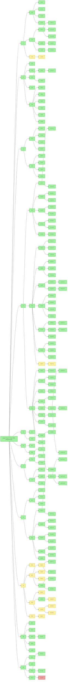

```mermaid
%%{init: { 'flowchart': {"curve": "monotoneX"}} }%%
graph LR
0[Super Chasm Hunter RPG Requirements]
0 --> 1
1 --> 1.1
1.1 --> 1.1.1
1.1 --> 1.1.2
1.1 --> 1.1.3
1.1 --> 1.1.4
1 --> 1.2
1.2 --> 1.2.1
1.2.1 --> 1.2.1.1
1.2.1 --> 1.2.1.2
1.2.1 --> 1.2.1.3
1.2 --> 1.2.2 --> 1.2.2.1
1.2 --> 1.2.3 --> 1.2.3.1
1 --> 1.3 --> 1.3.1
0 --> 2
2 --> 2.1
2 --> 2.2
2 --> 2.3
2.3 --> 2.3.1 --> 2.3.1.1
2.3 --> 2.3.2
2 --> 2.4
2 --> 2.5
2.5 --> 2.5.1
2.5 --> 2.5.2
2.5 --> 2.5.3
2.5 --> 2.5.4
2.5 --> 2.5.5
2.5 --> 2.5.6
0 --> 3
3 --> 3.1
3.1 --> 3.1.1
3.1 --> 3.1.2
3.1 --> 3.1.3
3.1 --> 3.1.4
3 --> 3.2
3.2 --> 3.2.1
3.2 --> 3.2.2
3.2 --> 3.2.3
3.2 --> 3.2.4
0 --> 4
4 --> 4.1
4.1 --> 4.1.1
4.1.1 --> 4.1.1.1
4.1.1 --> 4.1.1.2
4.1 --> 4.1.2
4.1.2 --> 4.1.2.1
4.1.2 --> 4.1.2.2
4.1 --> 4.1.3
4.1.3 --> 4.1.3.1
4.1.3 --> 4.1.3.2
4.1 --> 4.1.4
4.1.4 --> 4.1.4.1
4.1.4 --> 4.1.4.2
4.1 --> 4.1.5 --> 4.1.5.1
4 --> 4.2
4.2 --> 4.2.1
4.2.1 --> 4.2.1.1
4.2.1 --> 4.2.1.2
4.2.1 --> 4.2.1.3
4.2 --> 4.2.2
4.2.2 --> 4.2.2.1
4.2.2 --> 4.2.2.2
4.2.2 --> 4.2.2.3
4.2 --> 4.2.3
4.2.3 --> 4.2.3.1 --> 4.2.3.1.1
4.2.3 --> 4.2.3.2 --> 4.2.3.2.1
4.2 --> 4.2.4
4.2.4 --> 4.2.4.1
4.2.4 --> 4.2.4.2
4.2.4 --> 4.2.4.3
4.2.4 --> 4.2.4.4
4.2 --> 4.2.5
4.2.5 --> 4.2.5.1 --> 4.2.5.1.1
4.2.5 --> 4.2.5.2 --> 4.2.5.2.1
4.2.5 --> 4.2.5.3
4.2 --> 4.2.6
4.2.6 --> 4.2.6.1
4.2.6 --> 4.2.6.2
4.2.6 --> 4.2.6.3
4.2 --> 4.2.7
4.2.7 --> 4.2.7.1
4 --> 4.3
4.3 --> 4.3.1 --> 4.3.1.1
4.3 --> 4.3.2
4.3.2 --> 4.3.2.1
4.3.2 --> 4.3.2.2
4.3 --> 4.3.3 --> 4.3.3.1
4.3 --> 4.3.4
4.3.4 --> 4.3.4.1
4.3.4 --> 4.3.4.2
4.3.4.2 --> 4.3.4.2.1
4.3.4.2 --> 4.3.4.2.2
4.3.4.2 --> 4.3.4.2.3
4.3 --> 4.3.5
4.3 --> 4.3.6
4.3 --> 4.3.7
4.3.7 --> 4.3.7.1
4.3.7 --> 4.3.7.2
4.3 --> 4.3.8
4.3.8 --> 4.3.8.1
4.3.8 --> 4.3.8.2
4.3 --> 4.3.9
0 --> 5
5 --> 5.1
5 --> 5.2
0 --> 6
6 --> 6.1
6 --> 6.2
0 --> 7
7 --> 7.1
7.1 --> 7.1.1
7.1 --> 7.1.2
7.1 --> 7.1.3
7 --> 7.2
7.2 --> 7.2.1
7.2 --> 7.2.2
7.2 --> 7.2.3
0 --> 8
8 --> 8.1
8.1 --> 8.1.1
8.1 --> 8.1.2
8.1 --> 8.1.3
8 --> 8.2
8.2 --> 8.2.1
8.2.1 --> 8.2.1.1
8.2.1.1 --> 8.2.1.1.1
8.2.1.1 --> 8.2.1.1.2
8.2.1.1 --> 8.2.1.1.3
8.2.1 --> 8.2.1.2
8.2 --> 8.2.2
8.2.2 --> 8.2.2.1
8.2.2 --> 8.2.2.2
8.2 --> 8.2.3
8.2.3 --> 8.2.3.1
8.2.3 --> 8.2.3.2
8.2 --> 8.2.4
8.2.4 --> 8.2.4.1
8.2.4 --> 8.2.4.2
8.2 --> 8.2.5
0 --> 9
9 --> 9.1
9 --> 9.2
9.2 --> 9.2.1
9.2.1 --> 9.2.1.1
9.2.1 --> 9.2.1.2
9.2 --> 9.2.2
9.2 --> 9.2.3
9.2 --> 9.2.4
9.2.4 --> 9.2.4.1
9.2.4 --> 9.2.4.2
9 --> 9.3
9.3 --> 9.3.1
9.3 --> 9.3.2 --> 9.3.2.1
9.3 --> 9.3.3
9.3.3 --> 9.3.3.1
9.3.3 --> 9.3.3.2
9 --> 9.4 --> 9.4.1
0 --> 10
10 --> 10.1
10 --> 10.2
10 --> 10.3 --> 10.3.1
10 --> 10.4
10 --> 10.5
0 --> 11
11 --> 11.1
11 --> 11.2
11 --> 11.3
11.3 --> 11.3.1
11.3 --> 11.3.2
11.3 --> 11.3.3
11 --> 11.4

classDef verde fill:#a0f0a0,stroke:#2c2,stroke-width:2px,color:#555;
classDef giallo fill:#fff0a0,stroke:#cc2,stroke-width:2px,color:#555;
classDef rosso fill:#f0a0a0,stroke:#c22,stroke-width:2px,color:#555;
classDef blu fill:#00d5ff,stroke:#0023a3,stroke-width:2px,color:#555;

class 0,1,2,3,4,5,6,7,8,10,11 verde;
class 9 giallo;
class 1.1,1.2 verde;
class 1.3 giallo;
class 1.1.1,1.1.2,1.1.3,1.1.4 verde;
class 1.2.1,1.2.2,1.2.3 verde;
class 1.2.1.1,1.2.1.2,1.2.1.3 verde;
class 1.2.2.1,1.2.3.1 verde;
class 1.3.1 giallo;
class 2.1,2.2,2.3,2.4,2.5 verde;
class 2.3.1,2.3.2 verde;
class 2.3.1.1 verde;
class 2.5.1,2.5.2,2.5.3,2.5.4,2.5.5,2.5.6 verde;
class 3.1,3.2 verde;
class 3.1.1,3.1.2,3.1.3,3.1.4 verde;
class 3.2.1,3.2.2,3.2.3,3.2.4 verde;
class 4.1,4.2,4.3 verde;
class 4.1.1,4.1.2,4.1.3,4.1.4,4.1.5 verde;
class 4.1.1.1,4.1.1.2 verde;
class 4.1.2.1,4.1.2.2 verde;
class 4.1.3.1,4.1.3.2 verde;
class 4.1.4.1,4.1.4.2 verde;
class 4.1.5.1 verde;
class 4.2.1,4.2.2,4.2.3,4.2.4,4.2.5,4.2.6 verde;
class 4.2.7 giallo;
class 4.2.1.1,4.2.1.2,4.2.1.3 verde;
class 4.2.2.1,4.2.2.2,4.2.2.3 verde;
class 4.2.3.1,4.2.3.1.1,4.2.3.2,4.2.3.2.1 verde;
class 4.2.4.1,4.2.4.2,4.2.4.3,4.2.4.4 verde;
class 4.2.5.1,4.2.5.2,4.2.5.3,4.2.5.1.1,4.2.5.2.1 verde;
class 4.2.6.1,4.2.6.2,4.2.6.3 verde;
class 4.2.7.1 giallo;
class 4.3.1,4.3.2,4.3.3,4.3.4,4.3.5,4.3.6,4.3.7,4.3.8,4.3.9 verde;
class 4.3.1.1 verde;
class 4.3.2.1,4.3.2.2 verde;
class 4.3.3.1 verde;
class 4.3.4.1,4.3.4.2 verde;
class 4.3.4.2.1,4.3.4.2.2,4.3.4.2.3 verde;
class 4.3.7.1,4.3.7.2 verde;
class 4.3.8.1,4.3.8.2 verde;
class 5.1,5.2 verde;
class 6.1,6.2 verde;
class 7.1,7.2 verde;
class 7.1.1,7.1.2,7.1.3,7.2.1,7.2.2,7.2.3 verde;
class 8.1,8.2 verde;
class 8.1.1,8.1.2,8.1.3 verde;
class 8.2.1,8.2.2,8.2.3,8.2.4,8.2.5 verde;
class 8.2.1.1,8.2.1.2 verde;
class 8.2.1.1.1,8.2.1.1.2,8.2.1.1.3 verde;
class 8.2.2.1,8.2.2.2 verde;
class 8.2.3.1,8.2.3.2 verde;
class 8.2.4.1,8.2.4.2 verde;
class 9.1,9.2,9.3,9.4 giallo;
class 9.2.1,9.2.2,9.2.3 giallo;
class 9.2.4 verde;
class 9.2.1.1,9.2.1.2 verde;
class 9.2.4.1,9.2.4.2 verde;
class 9.3.1,9.3.3 giallo;
class 9.3.2 verde;
class 9.3.2.1 giallo;
class 9.3.3.1,9.3.3.2 giallo;
class 9.4.1 giallo;
class 10.1,10.2,10.3,10.3.1,10.4,10.5 verde;
class 11.1,11.2,11.3,11.4 verde;
class 11.3.1,11.3.2 verde;
class 11.3.3 rosso;
```