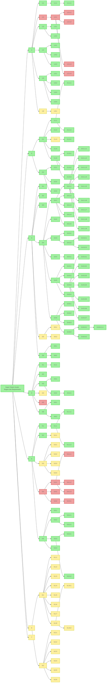

```mermaid
graph LR
    0[Super Chasm Hunter Rogue-Like Requirements]

    0 --> 1
    1 --> 1.1
    1.1 --> 1.1.1
    1.1.1 --> 1.1.1.1
    1 --> 1.2
    1.2 --> 1.2.1
    1.2.1 --> 1.2.1.1
    1.2.1 --> 1.2.1.2
    1.2.1 --> 1.2.1.3
    1.2.1 --> 1.2.1.4
    1 --> 1.3
    1.3 --> 1.3.1
    1.3 --> 1.3.2
    1 --> 1.4
    1.4 --> 1.4.1
    1.4 --> 1.4.2
    1.4 --> 1.4.3
    1 --> 1.5
    1.5 --> 1.5.1
    1.5 --> 1.5.2
    1.5 --> 1.5.3
    1.5 --> 1.5.4
    1 --> 1.6
    1.6 --> 1.6.1
    0 --> 2
    2 --> 2.1
    2.1 --> 2.1.1
    2.1.1 --> 2.1.1.1
    2.1.1 --> 2.1.1.2
    2.1 --> 2.1.2
    2.1 --> 2.1.3
    2.1.3 --> 2.1.3.1
    2.1 --> 2.1.4
    2.1 --> 2.1.5
    2.1.5 --> 2.1.5.1
    2.1.5 --> 2.1.5.2
    2.1.5 --> 2.1.5.3
    2 --> 2.2
    2.2 --> 2.2.1
    2.2 --> 2.2.2
    2.2 --> 2.2.3
    0 --> 3
    3 --> 3.1
    3 --> 3.2
    3 --> 3.3
    3 --> 3.4
    3.4 --> 3.4.1
    3.4.1 --> 3.4.1.1
    3.4.1.1 --> 3.4.1.1.1
    3.4.1.1 --> 3.4.1.1.2
    3.4.1.1 --> 3.4.1.1.3
    3.4.1.1 --> 3.4.1.1.4
    3.4.1.1 --> 3.4.1.1.5
    3.4.1.1 --> 3.4.1.1.6
    3.4.1.1 --> 3.4.1.1.7
    3.4.1.1 --> 3.4.1.1.8
    3.4.1.1 --> 3.4.1.1.9
    3.4.1 --> 3.4.1.2
    3.4.1 --> 3.4.1.3
    3.4.1 --> 3.4.1.4
    3.4.1 --> 3.4.1.5
    3.4 --> 3.4.2
    3.4 --> 3.4.3
    3.4.3 --> 3.4.3.1
    3.4.3 --> 3.4.3.2
    3.4.3.2 --> 3.4.3.2.1
    3.4.3.2 --> 3.4.3.2.2
    3.4 --> 3.4.4
    3.4.4 --> 3.4.4.1
    3.4 --> 3.4.5
    3.4.5 --> 3.4.5.1
    3.4.5 --> 3.4.5.2
    3.4.5 --> 3.4.5.3
    3.4.5.3 --> 3.4.5.3.1
    3.4.5.3 --> 3.4.5.3.2
    3.4.5.3 --> 3.4.5.3.3
    3.4.5.3 --> 3.4.5.3.4
    3.4.5.3 --> 3.4.5.3.5
    3.4.5.3 --> 3.4.5.3.6
    3.4.5.3 --> 3.4.5.3.7
    3.4.5 --> 3.4.5.4
    3.4 --> 3.4.6
    3.4.6 --> 3.4.6.1
    3.4.6 --> 3.4.6.2
    3.4.6 --> 3.4.6.3
    3.4.6 --> 3.4.6.4
    3.4.6.4 --> 3.4.6.4.1
    3.4.6.4.1 --> 3.4.6.4.1.1
    3.4.6.4 --> 3.4.6.4.2
    3 --> 3.5
    3.5 --> 3.5.1
    3.5 --> 3.5.2
    3 --> 3.6
    3.6 --> 3.6.1
    3.6 --> 3.6.2
    0 --> 4
    4 --> 4.1
    4.1 --> 4.1.1
    4 --> 4.2
    4 --> 4.3
    4.3 --> 4.3.1
    4.3 --> 4.3.2
    4.3.2 --> 4.3.2.1
    4 --> 4.4
    4 --> 4.5
    4 --> 4.6
    4.6 --> 4.6.1
    4.6 --> 4.6.2
    0 --> 5
    5 --> 5.1
    5.1 --> 5.1.1
    5.1.1 --> 5.1.1.1
    5.1.1 --> 5.1.1.2
    5 --> 5.2
    5.2 --> 5.2.1
    5 --> 5.3
    5.3 --> 5.3.1
    5.3 --> 5.3.2
    5.3 --> 5.3.3
    5.3 --> 5.3.4
    5 --> 5.4
    5.4 --> 5.4.1
    5.4.1 --> 5.4.1.1
    5.4.1 --> 5.4.1.2
    5.4.1 --> 5.4.1.3
    5.4 --> 5.4.2
    5.4 --> 5.4.3
    5.4.3 --> 5.4.3.1
    5 --> 5.5
    5.5 --> 5.5.1
    5.5 --> 5.5.2
    5.5.2 --> 5.5.2.1
    5.5.2 --> 5.5.2.2
    5.5 --> 5.5.3
    5.5.3 --> 5.5.3.1
    5.5.3 --> 5.5.3.2
    5.5 --> 5.5.4
    0 --> 6
    6 --> 6.1
    6.1 --> 6.1.1
    6.1 --> 6.1.2
    6.1 --> 6.1.3
    6.1 --> 6.1.4
    6.1 --> 6.1.5
    6.1 --> 6.1.6
    6.1 --> 6.1.7
    6.1 --> 6.1.8
    6.1.8 --> 6.1.8.1
    6.1.8 --> 6.1.8.2
    6 --> 6.2
    6.2 --> 6.2.1
    6.2 --> 6.2.2
    6.2 --> 6.2.3
    6.2 --> 6.2.4
    6.2 --> 6.2.5
    6.2 --> 6.2.6
    0 --> 7
    
    classDef verde fill:#a0f0a0,stroke:#2c2,stroke-width:2px,color:#555;
    classDef giallo fill:#fff0a0,stroke:#cc2,stroke-width:2px,color:#555;
    classDef rosso fill:#f0a0a0,stroke:#c22,stroke-width:2px,color:#555;
    classDef blu fill:#00d5ff,stroke:#0023a3,stroke-width:2px,color:#555;

    class 0,1,2,3,4,5 verde;
    class 6,7 giallo;
    class 1.1,1.3,1.4,1.5 verde;
    class 1.6 giallo;
    class 1.2 rosso;
    class 1.1.1 verde;
    class 1.1.1.1 verde;
    class 1.2.1 rosso;
    class 1.2.1.1,1.2.1.2,1.2.1.3,1.2.1.4 rosso;
    class 1.3.1,1.3.2 verde;
    class 1.4.1,1.4.2,1.4.3 verde;
    class 1.5.1,1.5.2,1.5.3,1.5.4 verde;
    class 1.6.1 giallo;
    class 2.1,2.2 verde;
    class 2.1.1,2.1.2,2.1.4,2.1.5 verde;
    class 2.1.3 giallo;
    class 2.1.1.1,2.1.1.2 verde;
    class 2.1.3.1 verde;
    class 2.1.5.1,2.1.5.2,2.1.5.3 verde;
    class 2.2.1,2.2.2,2.2.3 verde;
    class 3.1,3.2,3.3,3.4,3.6 verde;
    class 3.5 giallo;
    class 3.4.1,3.4.2,3.4.3,3.4.4,3.4.5,3.4.6 verde;
    class 3.4.1.1,3.4.1.2,3.4.1.3,3.4.1.4,3.4.1.5 verde;
    class 3.4.1.1.1,3.4.1.1.2,3.4.1.1.3,3.4.1.1.4,3.4.1.1.5,3.4.1.1.6,3.4.1.1.7,3.4.1.1.8,3.4.1.1.9 verde;
    class 3.4.3.1,3.4.3.2,3.4.3.2.1,3.4.3.2.2 verde;
    class 3.4.4.1 verde;
    class 3.4.5.1,3.4.5.2,3.4.5.3,3.4.5.4 verde;
    class 3.4.5.3.1,3.4.5.3.2,3.4.5.3.3,3.4.5.3.4,3.4.5.3.5,3.4.5.3.6,3.4.5.3.7 verde;
    class 3.4.6.1,3.4.6.2,3.4.6.3,3.4.6.4 verde;
    class 3.4.6.4.1,3.4.6.4.1.1,3.4.6.4.2 verde;
    class 3.5.1,3.5.2 giallo;
    class 3.6.1,3.6.2 verde;
    class 4.1,4.2,4.3,4.6 verde;
    class 4.4 giallo;
    class 4.5 rosso;
    class 4.1.1 verde;
    class 4.3.1,4.3.2,4.3.2.1 verde;
    class 4.6.1,4.6.2 verde;
    class 5.1,5.2,5.5 verde;
    class 5.3 giallo;
    class 5.4 rosso;
    class 5.1.1 verde;
    class 5.1.1.1,5.1.1.2 verde;
    class 5.2.1 giallo;
    class 5.3.1,5.3.2,5.3.3,5.3.4 giallo;
    class 5.4.1,5.4.2,5.4.3 rosso;
    class 5.4.1.1,5.4.1.2,5.4.1.3 rosso;
    class 5.4.3.1 rosso;
    class 5.5.1,5.5.2,5.5.3,5.5.4 verde;
    class 5.5.2.1,5.5.2.2 verde;
    class 5.5.3.1,5.5.3.2 verde;
    class 6.1,6.2 giallo;
    class 6.1.1,6.1.2,6.1.3,6.1.4,6.1.5,6.1.6,6.1.7,6.1.8 giallo;
    class 6.1.8.1,6.1.8.2, giallo;
    class 6.2.1,6.2.2,6.2.3,6.2.4,6.2.5,6.2.6 giallo;
```