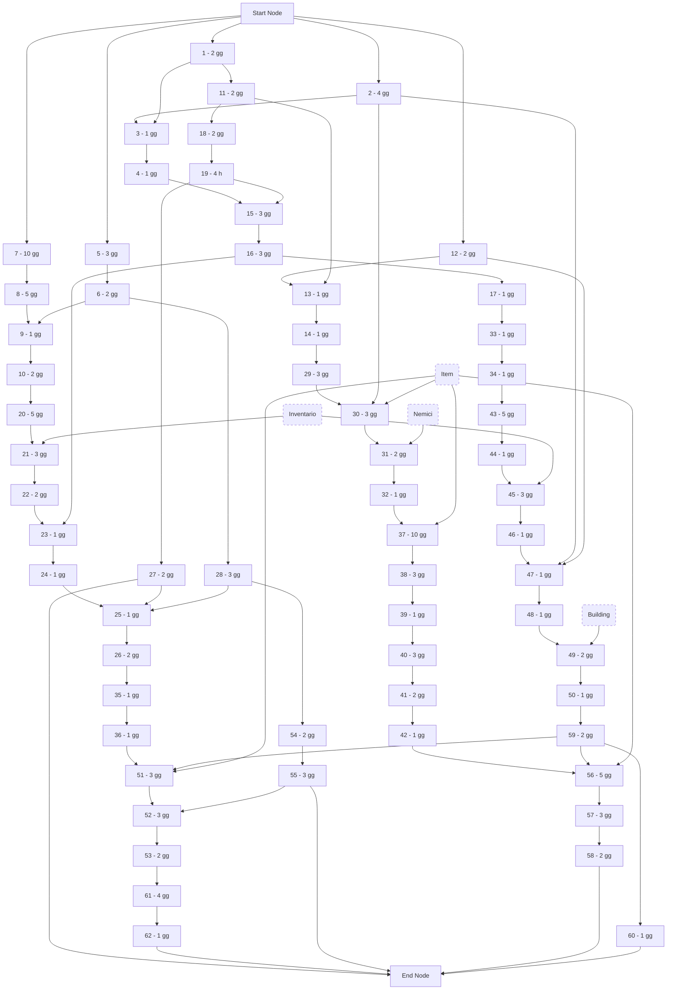
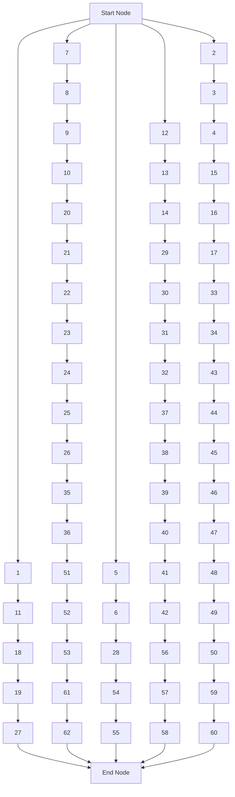
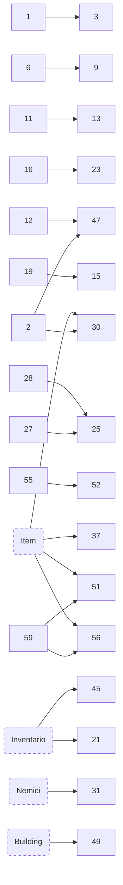

# Project Network Diagram

Partendo dall'elenco di tutte le task identificate tramite _giudizio dell'esperto_ è possibile costruire il **Project Network Diagram (PND)**.

## Elenco delle attività

| ID  | Nome                                            | Assegnatario | Durata | Early Start | Early Finish | Late Start | Late Finish | Slack |
| --- | ----------------------------------------------- | ------------ | ------ | ----------- | ------------ | ---------- | ----------- | ----- |
| 1   | Asset vita protagonista                         | Luca         | 2 gg   | 0           | 1            | 3          | 4           | 3     |
| 2   | Logica vita protagonista                        | Filippo G    | 4 gg   | 0           | 3            | 5          | 8           | 5     |
| 3   | Viz vita protagonista                           | Filippo G    | 1 gg   | 4           | 4            | 9          | 9           | 5     |
| 4   | Test vita prot                                  | Filippo G    | 1 gg   | 5           | 5            | 10         | 10          | 5     |
| 5   | Animazione flinching                            | Filippo P    | 3 gg   | 0           | 2            | 10         | 12          | 10    |
| 6   | Art status effect                               | Filippo P    | 2 gg   | 3           | 4            | 13         | 14          | 10    |
| 7   | Logica status effect - vita + mov               | Silvia       | 10 gg  | 0           | 9            | 0          | 9           | 0     |
| 8   | Logica status effect - arma                     | Silvia       | 5 gg   | 10          | 14           | 10         | 14          | 0     |
| 9   | Viz status effect                               | Silvia       | 1 gg   | 15          | 15           | 15         | 15          | 0     |
| 10  | Test status effect                              | Silvia       | 2 gg   | 16          | 17           | 16         | 17          | 0     |
| 11  | Asset 2D x mana prot                            | Luca         | 2 gg   | 2           | 3            | 5          | 6           | 3     |
| 12  | Logica mana                                     | Anny         | 2 gg   | 0           | 1            | 5          | 6           | 5     |
| 13  | Viz mana                                        | Anny         | 1 gg   | 4           | 4            | 7          | 7           | 3     |
| 14  | Test mana                                       | Anny         | 1 gg   | 5           | 5            | 8          | 8           | 3     |
| 15  | Logica gestione home menu - start, exit, social | Filippo G    | 3 gg   | 6.6         | 9.5          | 11         | 13          | 4.5   |
| 16  | Logica gestione impostazioni in home menu       | Filippo G    | 3 gg   | 10.6        | 13.5         | 14         | 16          | 4.5   |
| 17  | Test home menu                                  | Filippo G    | 1 gg   | 14.6        | 15.5         | 17         | 17          | 2.5   |
| 18  | Asset per menu home                             | Luca         | 2 gg   | 4           | 5            | 7.5        | 9.4         | 3.5   |
| 19  | Pagine social vuote x link                      | Luca         | 4 h    | 6           | 6.5          | 9.5        | 10          | 3.5   |
| 20  | Logica gestione mappa                           | Silvia       | 5 gg   | 18          | 22           | 18         | 22          | 0     |
| 21  | Viz inventario                                  | Silvia       | 3 gg   | 23          | 25           | 23         | 25          | 0     |
| 22  | Viz equipaggiamenti                             | Silvia       | 2 gg   | 26          | 27           | 26         | 27          | 0     |
| 23  | Gestione impostazioni in pause menu             | Silvia       | 1 gg   | 28          | 28           | 28         | 28          | 0     |
| 24  | Logica bottone exit                             | Silvia       | 1 gg   | 29          | 29           | 29         | 29          | 0     |
| 25  | Viz pause menu                                  | Silvia       | 1 gg   | 30          | 30           | 30         | 30          | 0     |
| 26  | Test pause menu                                 | Silvia       | 2 gg   | 31          | 32           | 31         | 32          | 0     |
| 27  | Art 2D pause menu                               | Luca         | 2 gg   | 6.6         | 8.5          | 27         | 29          | 20.5  |
| 28  | Animazioni cambio menu                          | Filippo P    | 3 gg   | 5           | 7            | 27         | 29          | 22    |
| 29  | HUD ingresso livello                            | Anny         | 3 gg   | 6           | 8            | 8          | 10          | 2     |
| 30  | Effetti di danno + effetti tranisizione         | Anny         | 3 gg   | 9           | 11           | 11         | 13          | 2     |
| 31  | Viz boss bar                                    | Anny         | 2 gg   | 12          | 13           | 14         | 15          | 2     |
| 32  | Test HUD                                        | Anny         | 1 gg   | 14          | 14           | 16         | 16          | 2     |
| 33  | Logica movimento prot                           | Filippo G    | 1 gg   | 15.6        | 16.5         | 18         | 18          | 2.5   |
| 34  | Test movimento prot                             | Filippo G    | 1 gg   | 16.6        | 17.5         | 19         | 19          | 2.5   |
| 35  | Logica orientamento prot                        | Silvia       | 1 gg   | 33          | 33           | 33         | 33          | 0     |
| 36  | Test orientamento prot                          | Silvia       | 1 gg   | 34          | 34           | 34         | 34          | 0     |
| 37  | Logica risoluzione effetto base                 | Anny         | 10 gg  | 15          | 24           | 17         | 26          | 2     |
| 38  | Test risoluzione effetto base                   | Anny         | 3 gg   | 25          | 27           | 27         | 29          | 2     |
| 39  | Viz risoluzione effetto base                    | Anny         | 1 gg   | 28          | 28           | 30         | 30          | 2     |
| 40  | Logica risoluzione effetto speciale             | Anny         | 3 gg   | 29          | 31           | 31         | 33          | 2     |
| 41  | Test risoluzione effetto speciale               | Anny         | 2 gg   | 32          | 33           | 34         | 35          | 2     |
| 42  | Viz risoluzione effetto speciale                | Anny         | 1 gg   | 34          | 34           | 36         | 36          | 2     |
| 43  | Logica salvataggio - quando                     | Filippo G    | 5 gg   | 17.6        | 22.5         | 20         | 24          | 2.5   |
| 44  | Test salvataggio - quando                       | Filippo G    | 1 gg   | 22.6        | 23.5         | 25         | 25          | 2.5   |
| 45  | Logica salvataggio - inventario, item in mano   | Filippo G    | 3 gg   | 23.6        | 26.5         | 26         | 28          | 2.5   |
| 46  | Test salvataggio - inventario, item in mano     | Filippo G    | 1 gg   | 26.6        | 27.5         | 29         | 29          | 2.5   |
| 47  | Logica salvataggio - vita, mana, data           | Filippo G    | 1 gg   | 27.6        | 28.5         | 30         | 30          | 2.5   |
| 48  | Test salvataggio - vita, mana, data             | Filippo G    | 1 gg   | 28.6        | 29.5         | 31         | 31          | 2.5   |
| 49  | Logica salvataggio - item piazzati              | Filippo G    | 2 gg   | 29.6        | 31.5         | 32         | 33          | 2.5   |
| 50  | Test salvataggio - item piazzati                | Filippo G    | 1 gg   | 31.6        | 32.5         | 34         | 34          | 2.5   |
| 51  | Vendita item                                    | Silvia       | 3 gg   | 35          | 37           | 35         | 37          | 0     |
| 52  | Gestione dialoghi                               | Silvia       | 3 gg   | 38          | 40           | 38         | 40          | 0     |
| 53  | Test vendita item + dialoghi                    | Silvia       | 2 gg   | 41          | 42           | 41         | 42          | 0     |
| 54  | Asset mercante                                  | Filippo P    | 2 gg   | 8           | 9            | 33         | 34          | 25    |
| 55  | Asset dialoghi                                  | Filippo P    | 3 gg   | 10          | 12           | 35         | 37          | 25    |
| 56  | Acquisto oggetti                                | Anny         | 5 gg   | 35          | 39           | 37         | 41          | 2     |
| 57  | Negozio aperto/chiuso                           | Anny         | 3 gg   | 40          | 42           | 42         | 44          | 2     |
| 58  | Test acquisto e apertura                        | Anny         | 2 gg   | 43          | 45           | 45         | 47          | 2     |
| 59  | Denaro                                          | Filippo G    | 2 gg   | 32.6        | 34.5         | 35         | 36          | 2.5   |
| 60  | Test denaro                                     | Filippo G    | 1 gg   | 34.6        | 35.5         | 47         | 47          | 2.5   |
| 61  | Munizioni                                       | Silvia       | 4 gg   | 43          | 46           | 43         | 46          | 0     |
| 62  | Test munizioni                                  | Silvia       | 1 gg   | 47          | 47           | 47         | 47          | 0     |

Giorni uomo totali: **146** giorni

| Assegnatario | Giorni totali |
| ------------ | ------------- |
| Luca         | 8,5           |
| Filippo G    | 33            |
| Filippo P    | 13            |
| Silvia       | 48            |
| Anny         | 43            |

Si noti che il lavoro è fortemente sblianciato verso la parte di sviluppo software per il fatto che questa iterazione non prevede grandi asset da sviluppare. Si stima che nelle iterazioni successive questo sbilanciamento tenderà dall'altra parte.

## Diagramma

Si sono dovute aggiungere alcune task fittizie che rappresentano dipendenze con le iterazioni successive. Per ogni dipedenza da esse si sfrutterà il _mocking_ per poter comunque procedere con l'implementazione.

### Dipendenze

Dalla tabella delle attività si può dedurre facilmente le dipendenze di personale, ossia l'impossibilità per la stessa persona di eseguire due task contemporaneamente.

Successivamente sono state analizzate le dipendenze tecniche, ovvero la necessità tecnica di finire una certa task prima di poterne incominciare un'altra.

### Diagramma delle dipendenze di personale

### Diagramma delle dipendenze tecniche

## Percorso critico

Il percorso critico è identificato dal percorso che, partendo dal nodo di inizio e arrivando alla fine, ogni nodo ha Slack = 0.

Il percorso critico è il seguente:

0 --> 7 --> 8 --> 9 --> 10 --> 20 --> 21 --> 22 --> 23 --> 24 --> 25 --> 26 --> 35 --> 36 --> 51 --> 52 --> 53 --> 61 --> 62 --> End
