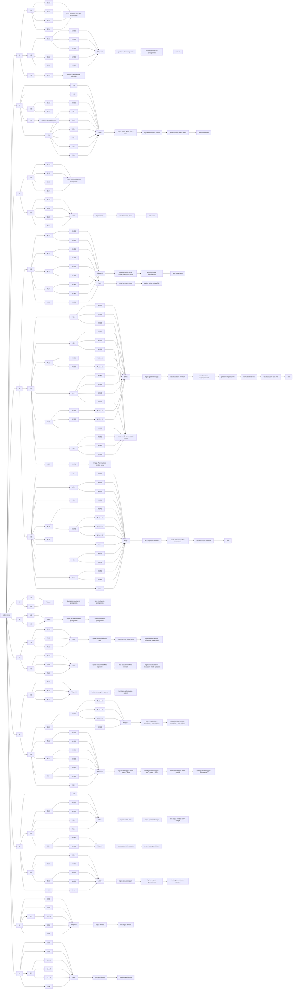

# Work Breakdown Structure

```mermaid
%%{init: { 'flowchart': {"curve": "monotoneX"}} }%%
graph LR
0[WBS RPG]
0 --> 1
1 --> 1.1
1.1 --> 1.1.1
1.1 --> 1.1.2
1.1 --> 1.1.3
1.1 --> 1.1.4
1 --> 1.2
1.2 --> 1.2.1
1.2.1 --> 1.2.1.1
1.2.1 --> 1.2.1.2
1.2.1 --> 1.2.1.3
1.2 --> 1.2.2 --> 1.2.2.1
1.2 --> 1.2.3 --> 1.2.3.1
1 --> 1.3 --> 1.3.1

1.1.1 --> L1[Luca, produrre asse vita protagonista]
1.1.2 --> L1
1.1.3 --> L1
1.1.4 --> L1
1.2.1.1 --> FG1[Filippo G]
1.2.1.2 --> FG1
1.2.1.3 --> FG1
1.2.2.1 --> FG1
1.2.3.1 --> FG1
FG1 --> FG1.1[gestione vita protagonista] --> FG1.2[visualizzazione vita protagonista] --> FG1.3[test vita]
1.3.1 --> FP1[Filippo P, animazione flinching]

0 --> 2
2 --> 2.1
2 --> 2.2
2 --> 2.3
2.3 --> 2.3.1 --> 2.3.1.1
2.3 --> 2.3.2
2 --> 2.4
2 --> 2.5
2.5 --> 2.5.1
2.5 --> 2.5.2
2.5 --> 2.5.3
2.5 --> 2.5.4
2.5 --> 2.5.5
2.5 --> 2.5.6

2.1 --> S1[Silvia]
2.2 --> S1
2.3.1.1 --> S1
2.4 --> FP2[Filippo P, art status effect]
2.5.1 --> S1
2.5.2 --> S1
2.5.3 --> S1
2.5.4 --> S1
2.5.5 --> S1
2.5.6 --> S1

S1 --> S1.1[logica status effect - vita + mov]
S1.1 --> S1.2[logica status effect - arma]
S1.2 --> S1.3[visualizzazione status effect]
S1.3 --> S1.4[test status effect]

0 --> 3
3 --> 3.1
3.1 --> 3.1.1
3.1 --> 3.1.2
3.1 --> 3.1.3
3.1 --> 3.1.4
3 --> 3.2
3.2 --> 3.2.1
3.2 --> 3.2.2
3.2 --> 3.2.3
3.2 --> 3.2.4

3.1.1 --> L3[Luca, asset 2D x mana protagonista]
3.1.2 --> L3
3.1.3 --> L3
3.1.4 --> L3

3.2.1 --> A3[Anny]
3.2.2 --> A3
3.2.3 --> A3
3.2.4 --> A3

A3 --> A3.1[logica mana]
A3.1 --> A3.2[visualizzazione mana]
A3.2 --> A3.3[test mana]

0 --> 4
4 --> 4.1
4.1 --> 4.1.1
4.1.1 --> 4.1.1.1
4.1.1 --> 4.1.1.2
4.1 --> 4.1.2
4.1.2 --> 4.1.2.1
4.1.2 --> 4.1.2.2
4.1 --> 4.1.3
4.1.3 --> 4.1.3.1
4.1.3 --> 4.1.3.2
4.1 --> 4.1.4
4.1.4 --> 4.1.4.1
4.1.4 --> 4.1.4.2
4.1 --> 4.1.5 --> 4.1.5.1
4 --> 4.2
4.2 --> 4.2.1
4.2.1 --> 4.2.1.1
4.2.1 --> 4.2.1.2
4.2.1 --> 4.2.1.3
4.2 --> 4.2.2
4.2.2 --> 4.2.2.1
4.2.2 --> 4.2.2.2
4.2.2 --> 4.2.2.3
4.2 --> 4.2.3
4.2.3 --> 4.2.3.1 --> 4.2.3.1.1
4.2.3 --> 4.2.3.2 --> 4.2.3.2.1
4.2 --> 4.2.4
4.2.4 --> 4.2.4.1
4.2.4 --> 4.2.4.2
4.2.4 --> 4.2.4.3
4.2.4 --> 4.2.4.4
4.2 --> 4.2.5
4.2.5 --> 4.2.5.1 --> 4.2.5.1.1
4.2.5 --> 4.2.5.2 --> 4.2.5.2.1
4.2.5 --> 4.2.5.3
4.2 --> 4.2.6
4.2.6 --> 4.2.6.1
4.2.6 --> 4.2.6.2
4.2.6 --> 4.2.6.3
4.2 --> 4.2.7
4.2.7 --> 4.2.7.1
4 --> 4.3
4.3 --> 4.3.1 --> 4.3.1.1
4.3 --> 4.3.2
4.3.2 --> 4.3.2.1
4.3.2 --> 4.3.2.2
4.3 --> 4.3.3 --> 4.3.3.1
4.3 --> 4.3.4
4.3.4 --> 4.3.4.1
4.3.4 --> 4.3.4.2
4.3.4.2 --> 4.3.4.2.1
4.3.4.2 --> 4.3.4.2.2
4.3.4.2 --> 4.3.4.2.3
4.3 --> 4.3.5
4.3 --> 4.3.6
4.3 --> 4.3.7
4.3.7 --> 4.3.7.1
4.3.7 --> 4.3.7.2
4.3 --> 4.3.8
4.3.8 --> 4.3.8.1
4.3.8 --> 4.3.8.2
4.3 --> 4.3.9

4.1.1.1 --> FG4[Filippo G]
4.1.2.1 --> FG4
4.1.3.1 --> FG4
4.1.4.1 --> FG4
4.1.4.2 --> FG4

FG4 --> FG4.1[logica gestione home menu - start, exit, social]
FG4.1 --> FG4.2[logica gestione impostazioni]
FG4.2 --> FG4.3[test home menu]

4.1.1.2 --> L4[Luca]
4.1.2.2 --> L4
4.1.3.2 --> L4
4.1.5.1 --> L4

L4 --> L4.1[asset per menu home]
L4.1 --> L4.2[pagine social vuote x link]

4.2.1.1 --> S4[Silvia]
4.2.1.2 --> S4
4.2.2.1 --> S4
4.2.2.2 --> S4
4.2.3.1.1 --> S4
4.2.3.2.1 --> S4
4.2.4.1 --> S4
4.2.4.2 --> S4
4.2.4.3 --> S4
4.2.5.1.1 --> S4
4.2.5.2.1 --> S4

S4 --> S4.1[logica gestione mappa]
S4.1 --> S4.2[visualizzazione inventario]
S4.2 --> S4.3[visualizzazione equipaggiamenti]
S4.3 --> S4.4[gestione impostazioni]
S4.4 --> S4.5[logica bottone exit]
S4.5 --> S4.6[visualizzazione task prec]
S4.6 --> S4.7[test]

4.2.1.3 --> L42[Luca, art 2D schermata di pausa]
4.2.2.3 --> L42
4.2.4.4 --> L42
4.2.5.3 --> L42

4.2.6.1 --> L42
4.2.6.2 --> L42
4.2.6.3 --> L42

4.2.7.1 --> FP4[Filippo P, animazioni cambio menu]

4.3.4.1 --> A4[Anny]
4.3.1.1 --> A4
4.3.2.1 --> A4
4.3.2.2 --> A4
4.3.3.1 --> A4
4.3.4.2.1 --> A4
4.3.4.2.2 --> A4
4.3.4.2.3 --> A4
4.3.6 --> A4
4.3.7.1 --> A4
4.3.7.2 --> A4
4.3.8.1 --> A4
4.3.8.2 --> A4
4.3.9 --> A4

A4 --> A4.1[HUD ingresso al livello]
A4.1 --> A4.2[effetti di danno + effetti transizione]
A4.2 --> A4.3[visualizzazione boss bar]
A4.3 --> A4.4[test]

0 --> 5
5 --> 5.1
5 --> 5.2

5.1 --> FG5[Filippo G]
5.2 --> FG5

FG5 --> FG5.1[logica per movimento protagonista]
FG5.1 --> FG5.2[test movimento protagonista]

0 --> 6
6 --> 6.1 --> S6[Silvia]
6 --> 6.2 --> S6

S6 --> S6.1[logica per orientamento protagonista]
S6.1 --> S6.2[test orientamento protagonista]

0 --> 7
7 --> 7.1
7.1 --> 7.1.1 --> A7[Anny]
7.1 --> 7.1.2 --> A7
7.1 --> 7.1.3 --> A7
7 --> 7.2
7.2 --> 7.2.1 --> A71[Anny]
7.2 --> 7.2.2 --> A71
7.2 --> 7.2.3 --> A71

A7 --> A7.1[logica risoluzione effetto base]
A7.1 --> A7.2[test risoluzione effetto base]
A7.2 --> A7.3[logica visualizzazione risoluzione effetto base]

A71 --> A71.1[logica risoluzione effetto speciale]
A71.1 --> A71.2[test risoluzione effetto speciale]
A71.2 --> A71.3[logica visualizzazione risoluzione effetto speciale]

0 --> 8
8 --> 8.1
8.1 --> 8.1.1 --> F8[Filippo G]
8.1 --> 8.1.2 --> F8
8.1 --> 8.1.3 --> F8
8 --> 8.2
8.2 --> 8.2.1
8.2.1 --> 8.2.1.1
8.2.1.1 --> 8.2.1.1.1 --> F81[Filippo G]
8.2.1.1 --> 8.2.1.1.2 --> F81
8.2.1.1 --> 8.2.1.1.3 --> F81
8.2.1 --> 8.2.1.2 --> F81
8.2 --> 8.2.2
8.2.2 --> 8.2.2.1 --> F82[Filippo G]
8.2.2 --> 8.2.2.2 --> F82
8.2 --> 8.2.3
8.2.3 --> 8.2.3.1 --> F82
8.2.3 --> 8.2.3.2 --> F82
8.2 --> 8.2.4
8.2.4 --> 8.2.4.1 --> F82
8.2.4 --> 8.2.4.2 --> F82
8.2 --> 8.2.5 --> F82

F8 --> F8.1[logica salvataggio - quando]
F8.1 --> F8.2[test logica salvataggio - quando]
F81 --> F81.1[logica salvataggio - inventario + item in mano]
F81.1 --> F81.2[test logica salvataggio - inventario + item in mano]
F82 --> F82.1[logica salvataggio - vita + mana + data]
F82.1 --> F82.2[test logica salvataggio - vita + mana + data]
F82.2 --> F82.3[logica salvataggio - item piazzati]
F82.3 --> F82.4[test logica salvataggio - item piazzati]

0 --> 9
9 --> 9.1 --> S9[Silvia]
9 --> 9.2
9.2 --> 9.2.1
9.2.1 --> 9.2.1.1 --> S9
9.2.1 --> 9.2.1.2 --> S9
9.2 --> 9.2.2 --> S9
9.2 --> 9.2.3 --> S9
9.2 --> 9.2.4
9.2.4 --> 9.2.4.1 --> F9[Filippo P]
9.2.4 --> 9.2.4.2 --> F9
9 --> 9.3
9.3 --> 9.3.1 --> A9[Anny]
9.3 --> 9.3.2 --> 9.3.2.1 --> A9
9.3 --> 9.3.3
9.3.3 --> 9.3.3.1 --> A9
9.3.3 --> 9.3.3.2 --> A9
9 --> 9.4 --> 9.4.1 --> A9

S9 --> S9.1[logica vendita item]
S9.1 --> S9.2[logica gestione dialoghi]
S9.2 --> S9.3[test logica vendita item + dialoghi]

F9 --> F9.1[creare asset del mercante]
F9.1 --> F9.2[creare asset per dialoghi]

A9 --> A9.1[logica acquisto oggetti]
A9.1 --> A9.2[logica negozio aperto/chiuso]
A9.2 --> A9.3[test logica acquisto e apertura]

0 --> 10
10 --> 10.1 --> F10[Filippo G]
10 --> 10.2 --> F10
10 --> 10.3 --> 10.3.1 --> F10
10 --> 10.4 --> F10
10 --> 10.5 --> F10

F10 --> F10.1[logica denaro]
F10.1 --> F10.2[test logica denaro]

0 --> 11
11 --> 11.1 --> S11[Silvia]
11 --> 11.2 --> S11
11 --> 11.3
11.3 --> 11.3.1 --> S11
11.3 --> 11.3.2 --> S11
11.3 --> 11.3.3 --> S11
11 --> 11.4 --> S11

S11 --> S11.1[logica munizioni]
S11.1 --> S11.2[test logica munizioni]
```
