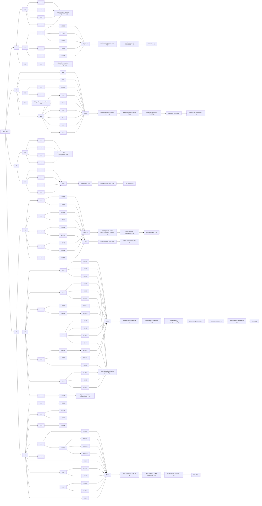

# Work Breakdown Structure

```mermaid
%%{init: { 'flowchart': {"curve": "monotoneX"}} }%%
graph LR
0[WBS RPG]
0 --> 1
1 --> 1.1
1.1 --> 1.1.1
1.1 --> 1.1.2
1.1 --> 1.1.3
1.1 --> 1.1.4
1 --> 1.2
1.2 --> 1.2.1
1.2.1 --> 1.2.1.1
1.2.1 --> 1.2.1.2
1.2.1 --> 1.2.1.3
1.2 --> 1.2.2 --> 1.2.2.1
1.2 --> 1.2.3 --> 1.2.3.1
1 --> 1.3 --> 1.3.1

1.1.1 --> L1[Luca, produrre asse vita protagonista, 1 gg]
1.1.2 --> L1
1.1.3 --> L1
1.1.4 --> L1
1.2.1.1 --> FG1[Filippo G]
1.2.1.2 --> FG1
1.2.1.3 --> FG1
1.2.2.1 --> FG1
1.2.3.1 --> FG1
FG1 --> FG1.1[gestione vita protagonista, 2 gg] --> FG1.2[visualizzazione vita protagonista, 1 gg] --> FG1.3[test vita, 1 gg]
1.3.1 --> FP1[Filippo P, animazione flinching, 1 gg]

0 --> 2
2 --> 2.1
2 --> 2.2
2 --> 2.3
2.3 --> 2.3.1 --> 2.3.1.1
2.3 --> 2.3.2
2 --> 2.4
2 --> 2.5
2.5 --> 2.5.1
2.5 --> 2.5.2
2.5 --> 2.5.3
2.5 --> 2.5.4
2.5 --> 2.5.5
2.5 --> 2.5.6

2.1 --> S1[Silvia]
2.2 --> S1
2.3.1.1 --> S1
2.4 --> FP2[Filippo P, art status effect, 2 gg]
2.5.1 --> S1
2.5.2 --> S1
2.5.3 --> S1
2.5.4 --> S1
2.5.5 --> S1
2.5.6 --> S1

S1 --> S1.1[logica status effect - vita + mov, 2 gg]
S1.1 --> S1.2[logica status effect - arma, 2 gg]
S1.2 --> S1.3[visualizzazione status effect, 1 gg]
S1.3 --> S1.4[test status effect, 1 gg]
S1.4 --> S1.5[Filippo P, art status effect, 2 gg]

0 --> 3
3 --> 3.1
3.1 --> 3.1.1
3.1 --> 3.1.2
3.1 --> 3.1.3
3.1 --> 3.1.4
3 --> 3.2
3.2 --> 3.2.1
3.2 --> 3.2.2
3.2 --> 3.2.3
3.2 --> 3.2.4

3.1.1 --> L3[Luca, asset 2D x mana protagonista, 1 gg]
3.1.2 --> L3
3.1.3 --> L3
3.1.4 --> L3

3.2.1 --> A3[Anny]
3.2.2 --> A3
3.2.3 --> A3
3.2.4 --> A3

A3 --> A3.1[logica mana, 2 gg]
A3.1 --> A3.2[visualizzazione mana, 1 gg]
A3.2 --> A3.3[test mana, 1 gg]

0 --> 4
4 --> 4.1
4.1 --> 4.1.1
4.1.1 --> 4.1.1.1
4.1.1 --> 4.1.1.2
4.1 --> 4.1.2
4.1.2 --> 4.1.2.1
4.1.2 --> 4.1.2.2
4.1 --> 4.1.3
4.1.3 --> 4.1.3.1
4.1.3 --> 4.1.3.2
4.1 --> 4.1.4
4.1.4 --> 4.1.4.1
4.1.4 --> 4.1.4.2
4.1 --> 4.1.5 --> 4.1.5.1
4 --> 4.2
4.2 --> 4.2.1
4.2.1 --> 4.2.1.1
4.2.1 --> 4.2.1.2
4.2.1 --> 4.2.1.3
4.2 --> 4.2.2
4.2.2 --> 4.2.2.1
4.2.2 --> 4.2.2.2
4.2.2 --> 4.2.2.3
4.2 --> 4.2.3
4.2.3 --> 4.2.3.1 --> 4.2.3.1.1
4.2.3 --> 4.2.3.2 --> 4.2.3.2.1
4.2 --> 4.2.4
4.2.4 --> 4.2.4.1
4.2.4 --> 4.2.4.2
4.2.4 --> 4.2.4.3
4.2.4 --> 4.2.4.4
4.2 --> 4.2.5
4.2.5 --> 4.2.5.1 --> 4.2.5.1.1
4.2.5 --> 4.2.5.2 --> 4.2.5.2.1
4.2.5 --> 4.2.5.3
4.2 --> 4.2.6
4.2.6 --> 4.2.6.1
4.2.6 --> 4.2.6.2
4.2.6 --> 4.2.6.3
4.2 --> 4.2.7
4.2.7 --> 4.2.7.1
4 --> 4.3
4.3 --> 4.3.1 --> 4.3.1.1
4.3 --> 4.3.2
4.3.2 --> 4.3.2.1
4.3.2 --> 4.3.2.2
4.3 --> 4.3.3 --> 4.3.3.1
4.3 --> 4.3.4
4.3.4 --> 4.3.4.1
4.3.4 --> 4.3.4.2
4.3.4.2 --> 4.3.4.2.1
4.3.4.2 --> 4.3.4.2.2
4.3.4.2 --> 4.3.4.2.3
4.3 --> 4.3.5
4.3 --> 4.3.6
4.3 --> 4.3.7
4.3.7 --> 4.3.7.1
4.3.7 --> 4.3.7.2
4.3 --> 4.3.8
4.3.8 --> 4.3.8.1
4.3.8 --> 4.3.8.2
4.3 --> 4.3.9

4.1.1.1 --> FG4[Filippo G]
4.1.2.1 --> FG4
4.1.3.1 --> FG4
4.1.4.1 --> FG4
4.1.4.2 --> FG4

FG4 --> FG4.1[logica gestione home menu - start, exit, social, 1 gg]
FG4.1 --> FG4.2[logica gestione impostazioni, 2 gg]
FG4.2 --> FG4.3[test home menu, 1 gg]

4.1.1.2 --> L4[Luca]
4.1.2.2 --> L4
4.1.3.2 --> L4
4.1.5.1 --> L4

L4 --> L4.1[asset per menu home, 2 gg]
L4.1 --> L4.2[pagine social vuote x link, 2h]

4.2.1.1 --> S4[Silvia]
4.2.1.2 --> S4
4.2.2.1 --> S4
4.2.2.2 --> S4
4.2.3.1.1 --> S4
4.2.3.2.1 --> S4
4.2.4.1 --> S4
4.2.4.2 --> S4
4.2.4.3 --> S4
4.2.5.1.1 --> S4
4.2.5.2.1 --> S4

S4 --> S4.1[logica gestione mappa, 1 gg]
S4.1 --> S4.2[visualizzazione inventario, 2 gg]
S4.2 --> S4.3[visualizzazione equipaggiamenti, 2 gg]
S4.3 --> S4.4[gestione impostazioni, 4h]
S4.4 --> S4.5[logica bottone exit, 4h]
S4.5 --> S4.6[visualizzazione task prec, 2 gg]
S4.6 --> S4.7[test, 2 gg]

4.2.1.3 --> L42[Luca, art 2D schermata di pausa, 2 gg]
4.2.2.3 --> L42
4.2.4.4 --> L42
4.2.5.3 --> L42

4.2.6.1 --> L42
4.2.6.2 --> L42
4.2.6.3 --> L42

4.2.7.1 --> FP4[Filippo P, animazioni cambio menu, 1 gg]

4.3.4.1 --> A4[Anny]
4.3.4.2.1 --> A4
4.3.4.2.2 --> A4
4.3.4.2.3 --> A4
4.3.6 --> A4
4.3.7.1 --> A4
4.3.7.2 --> A4
4.3.8.1 --> A4
4.3.8.2 --> A4
4.3.9 --> A4

A4 --> A4.1[HUD ingresso al livello, 1 gg]
A4.1 --> A4.2[effetti di danno + effetti transizione, 1 gg]
A4.2 --> A4.3[visualizzazione boss bar, 1 gg]
A4.3 --> A4.4[test, 2 gg]
```