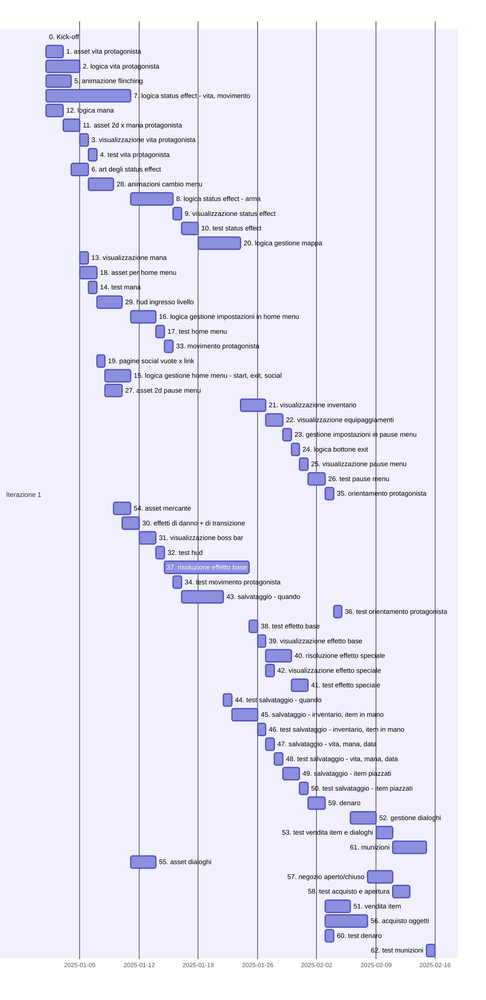

# Gantt Chart

```mermaid
gantt
    dateFormat DD-MM-YYYY
    section Iterazione 1
        0. Kick-off :t0, 01-01-2025, 0d
        1. asset vita protagonista :t1, after t0, 2d
        2. logica vita protagonista :t2, after t0, 4d
        5. animazione flinching :t5, after t0, 3d
        7. logica status effect - vita, movimento :t7, after t0, 10d
        12. logica mana :t12, after t0, 2d
        11. asset 2d x mana protagonista :t11, after t1, 2d
        3. visualizzazione vita protagonista :t3, after t2, 1d
        4. test vita protagonista :t4, after t3, 1d
        6. art degli status effect :t6, after t5, 2d
        28. animazioni cambio menu :t28, after t6, 3d
        8. logica status effect - arma :t8, after t7, 5d
        9. visualizzazione status effect :t9, after t8, 1d
        10. test status effect :t10, after t9, 2d
        20. logica gestione mappa :t20, after t10, 5d
        13. visualizzazione mana :t13, after t11, 1d
        18. asset per home menu :t18, after t11, 2d
        14. test mana :t14, after t13, 1d
        29. hud ingresso livello :t29, after t14, 3d
        16. logica gestione impostazioni in home menu :t16, after t15, 3d
        17. test home menu :t17, after t16, 1d
        33. movimento protagonista :t33, after t17, 1d
        19. pagine social vuote x link :t19, after t18, 0.5d
        15. logica gestione home menu - start, exit, social :t15, after t19, 3d
        27. asset 2d pause menu :t27, after t19, 2d
        21. visualizzazione inventario :t21, after t20, 3d
        22. visualizzazione equipaggiamenti :t22, after t21, 2d
        23. gestione impostazioni in pause menu :t23, after t22, 1d
        24. logica bottone exit :t24, after t23, 1d
        25. visualizzazione pause menu :t25, after t24, 1d
        26. test pause menu :t26, after t25, 2d
        35. orientamento protagonista :t35, after t26, 1d
        54. asset mercante :t54, after t28, 2d
        30. effetti di danno + di transizione :t30, after t29, 2d
        31. visualizzazione boss bar :t31, after t30, 2d
        32. test hud :t32, after t31, 1d
        37. risoluzione effetto base :t37, after t32, 10d
        34. test movimento protagonista :t34, after t33, 1d
        43. salvataggio - quando :t43, after t34, 5d
        36. test orientamento protagonista :t36, after t35, 1d
        38. test effetto base :t38, after t37, 1d
        39. visualizzazione effetto base :t39, after t38, 1d
        40. risoluzione effetto speciale :t40, after t39, 3d
        42. visualizzazione effetto speciale :t42, after t39, 1d
        41. test effetto speciale :t41, after t40, 2d
        44. test salvataggio - quando :t44, after t43, 1d
        45. salvataggio - inventario, item in mano :t45, after t44, 3d
        46. test salvataggio - inventario, item in mano :t46, after t45, 1d
        47. salvataggio - vita, mana, data :t47, after t46, 1d
        48. test salvataggio - vita, mana, data :t48, after t47, 1d
        49. salvataggio - item piazzati :t49, after t48, 2d
        50. test salvataggio - item piazzati :t50, after t49, 1d
        59. denaro :t59, after t50, 2d
        52. gestione dialoghi :t52, after t51, 3d
        53. test vendita item e dialoghi :t53, after t52, 2d
        61. munizioni :t61, after t53, 4d
        55. asset dialoghi :t55, after t54, 3d
        57. negozio aperto/chiuso :t57, after t56, 3d
        58. test acquisto e apertura :t58, after t57, 2d
        51. vendita item :t51, after t59, 3d
        56. acquisto oggetti :t56, after t59, 5d
        60. test denaro :t60, after t59, 1d
        62. test munizioni :t62, after t61, 1d
```
