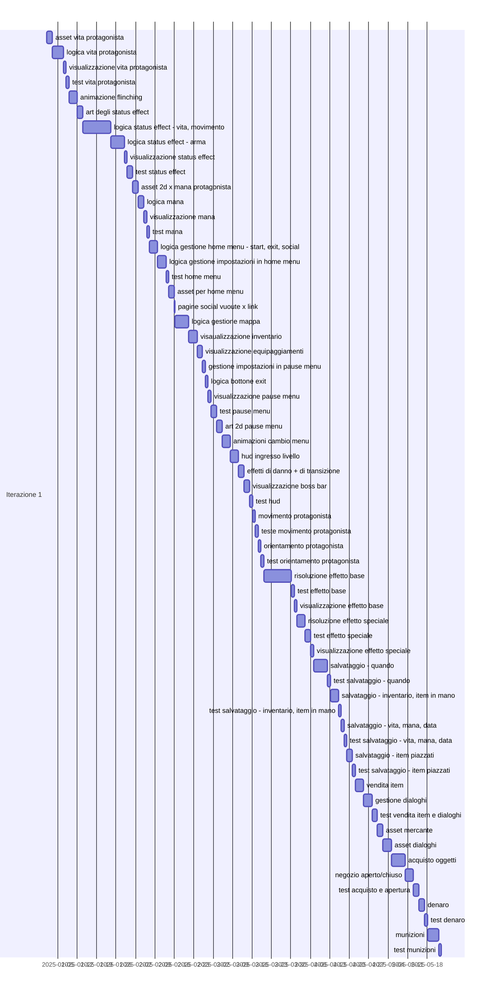

# Gantt Chart

```mermaid
gantt
    dateFormat DD-MM-YYYY
    section Iterazione 1
        asset vita protagonista: 01-01-2025, 2d
        logica vita protagonista: 4d
        visualizzazione vita protagonista: 1d
        test vita protagonista: 1d
        animazione flinching: 3d
        art degli status effect: 2d
        logica status effect - vita, movimento: 10d
        logica status effect - arma: 5d
        visualizzazione status effect: 1d
        test status effect: 2d
        asset 2d x mana protagonista: 2d
        logica mana: 2d
        visualizzazione mana: 1d
        test mana: 1d
        logica gestione home menu - start, exit, social: 3d
        logica gestione impostazioni in home menu: 3d
        test home menu: 1d
        asset per home menu: 2d
        pagine social vuoute x link: 4h
        logica gestione mappa: 5d
        visaualizzazione inventario: 3d
        visualizzazione equipaggiamenti: 2d
        gestione impostazioni in pause menu: 1d
        logica bottone exit: 1d
        visualizzazione pause menu: 1d
        test pause menu: 2d
        art 2d pause menu: 2d
        animazioni cambio menu: 3d
        hud ingresso livello: 3d
        effetti di danno + di transizione: 2d
        visualizzazione boss bar: 2d
        test hud: 1d
        movimento protagonista: 1d
        teste movimento protagonista: 1d
        orientamento protagonista: 1d
        test orientamento protagonista: 1d
        risoluzione effetto base: 10d
        test effetto base: 1d
        visualizzazione effetto base: 1d
        risoluzione effetto speciale: 3d
        test effetto speciale: 2d
        visualizzazione effetto speciale: 1d
        salvataggio - quando: 5d
        test salvataggio - quando: 1d
        salvataggio - inventario, item in mano: 3d
        test salvataggio - inventario, item in mano: 1d
        salvataggio - vita, mana, data: 1d
        test salvataggio - vita, mana, data: 1d
        salvataggio - item piazzati: 2d
        test salvataggio - item piazzati: 1d
        vendita item: 3d
        gestione dialoghi: 3d
        test vendita item e dialoghi: 2d
        asset mercante: 2d
        asset dialoghi: 3d
        acquisto oggetti: 5d
        negozio aperto/chiuso: 3d
        test acquisto e apertura: 2d
        denaro: 2d
        test denaro: 1d
        munizioni: 4d
        test munizioni: 1d
```
