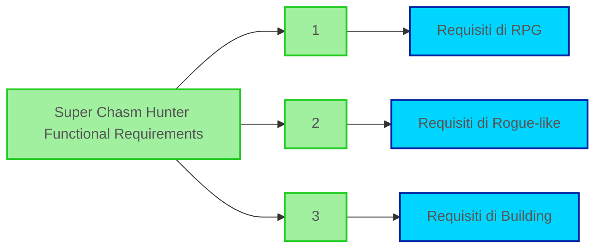

```mermaid
%%{init: { 'flowchart': {"curve": "monotoneX"}} }%%
graph LR
    0[Super Chasm Hunter Functional Requirements]
    1
    1.1[Requisiti di RPG]
    2
    2.1[Requisiti di Rogue-like]
    3
    3.1[Requisiti di Building]

    0 --> 1
    0 --> 2
    0 --> 3
    1 --> 1.1
    2 --> 2.1
    3 --> 3.1

    classDef verde fill:#a0f0a0,stroke:#2c2,stroke-width:2px,color:#555;
    classDef giallo fill:#fff0a0,stroke:#cc2,stroke-width:2px,color:#555;
    classDef rosso fill:#f0a0a0,stroke:#c22,stroke-width:2px,color:#555;
    classDef blu fill:#00d5ff,stroke:#0023a3,stroke-width:2px,color:#555;
    click 1.1 "https://filippogurioli.github.io/super-chasm-hunter-pm/appendices/scoping/RBSs/rpg-requirements/" "Requisiti di RPG"
    click 2.1 "https://filippogurioli.github.io/super-chasm-hunter-pm/appendices/scoping/RBSs/rogue-like-requirements/" "Requisiti di Rogue-like"
    click 3.1 "https://filippogurioli.github.io/super-chasm-hunter-pm/appendices/scoping/RBSs/building-requirements/" "Requisiti di Building"
    
    class 0,1,2,3 verde;
    class 1.1,2.1,3.1 blu;
```