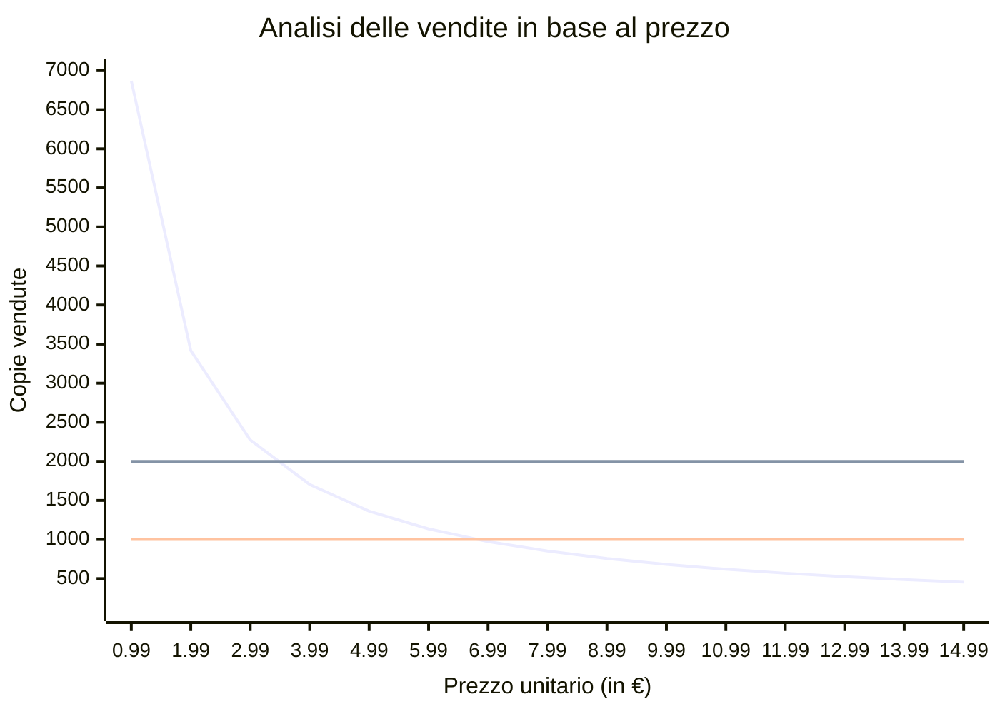

# Analisi finanziaria

## Business Model

Il progetto genererà ricavi attraverso la vendita del videogioco sulla piattaforma [Steam](https://store.steampowered.com/?l=italian).  
Steam applica una commissione pari al 30% sul prezzo di copertina di ogni copia venduta, mentre il restante 70% viene destinato all’azienda produttrice.  

La piattaforma consente inoltre di partecipare a promozioni stagionali, che permettono di applicare sconti temporanei al prodotto per aumentarne la visibilità e favorire le vendite.  

Infine, al momento della pubblicazione sarà obbligatoria l’apertura di una partita IVA, con relativa tassazione (3,35%) sui ricavi netti.

## Studio di fattibilità

Per valutare la sostenibilità economica del progetto è stato predisposto un [foglio di calcolo](https://docs.google.com/spreadsheets/d/1B05SoctmiqgcXIOkPyeojWCbAbP05F1OtZ33VDwz1cA/edit?usp=sharing) che tiene conto di:

1. **Costi fissi**: 3.600€ (2.800€ di apertura partita IVA + 800€ di commercialista).  
2. **Costi variabili**: circa 500€, legati all’acquisto di strumenti o asset di terze parti.  
3. **Stima prudente delle copie vendute**: circa 700 unità.

Si è stimato che per poter produrre 4100€ (3600 + 500 di costi) sarà necessario un fatturato di circa 6300€, considerando la commissione di Steam e la tassazione vigente.

Dal grafico elaborato si osserva che, per coprire i costi complessivi (6.300€), il prezzo minimo sostenibile sarebbe intorno ai **6,99€**, considerando il valore più basso delle vendite attese per il genere di riferimento (1000 copie).

Tuttavia, il team ha scelto un prezzo di **8,99€**, che rimane comunque nella fascia bassa del mercato, in quanto:  

- riduce il numero di copie necessarie per raggiungere il pareggio (circa 700);  
- non compromette l’accessibilità del titolo ai potenziali acquirenti.  

Altri costi indiretti (es. consumo elettrico) non sono stati considerati rilevanti.

In conclusione, il progetto risulta *fattibile* dal punto di vista economico.
